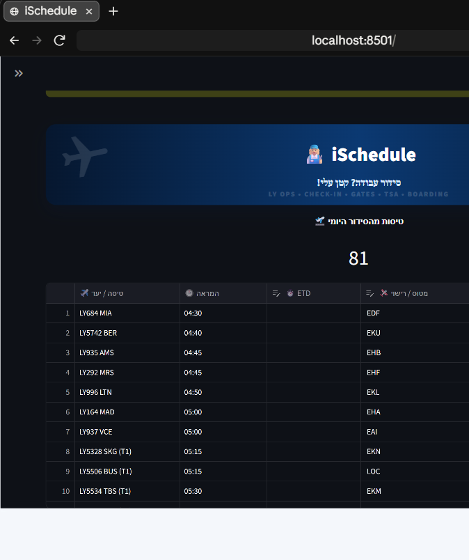

# iSchedule

A crew-scheduling system for the departure halls at Ben Gurion Airport. It takes the day's
flights and the day's rostered staff, and produces a complete assignment — who works which
flight, in which role, when they break, and when they move between terminals.

Built and used by a shift manager for real daily operations.

**🔗 [Try the live demo](https://ischedule-demo-2tnnwihccjlsrq525k8eea.streamlit.app)** — log
in with `demo` / `ischedule-demo`, then click **"🧪 טען נתוני דמו"** to load a sample day
(anonymized names and flight numbers) and build a schedule.



---

## What it does

A flight is not one job. Each departure needs a team lead, a number of agents that depends
on the aircraft and passenger count, and — for US-bound flights — a TSA inspector and a TSA
guard. Queue coordinators are needed on some destinations, and a team-lead trainee shadows a
qualified mentor.

The system reads the flight list and the staff roster, and fills every one of those slots
from the people actually on shift, respecting:

- **Certifications** — each role can only be filled by someone qualified for it
- **Shift windows and availability**, including workers who split a shift between terminals
- **Mandatory breaks** — length by shift length, placed where the work allows
- **Terminal transfers** — a worker moving between Terminal 3 and Terminal 1 is left time for
  a break plus the shuttle before they are due at the other terminal
- **Trainee pairing** — a trainee is assigned alongside their mentor, never alone
- **Restricted-worker quotas** — a cap per flight on workers with limited duties

Every assignment carries a `סיבה` ("reason") field recording why that worker was chosen,
so a decision can be traced rather than guessed at.

## Input

Five files are uploaded per operational day:

| File | Contents |
|---|---|
| FIDS — today | Departure board export for today |
| FIDS — tomorrow | Departure board export for tomorrow (the night flights cross midnight) |
| Daily roster — Terminal 3 | Who works, which hours, which section |
| Daily roster — Terminal 1 | The same for Terminal 1 |
| Employee certifications | Per-worker roles, qualifications and duty limitations |

The rosters are hand-maintained Excel sheets, so a large part of the work is reading them
faithfully: merged header cells, notes written next to a name, colour-coded annotations that
link a floating note to a group of workers, and the same person appearing in two sections on
two different days.

## Building a schedule

The day can be built in one pass, or — as operations actually run it — in three: the night
team builds through the last flight their shift covers, the day team continues from there,
and the evening team takes the flights after midnight. Each build continues the previous one
rather than replacing it; earlier segments are locked, and a worker whose shift outlasts the
built range is shown "המשך יבוא" instead of a false end-of-day.

## Screens

| Tab | Purpose |
|---|---|
| 🛠️ סידור עבודה | The assignment itself, per flight, with manual swap |
| 📋 זרימת עבודה | Per-worker timeline: flights, breaks, walks to the gate, terminal moves |
| ⏱️ מרכז בקרה | Who is working now, shift hours, terminal, arrivals, removals |
| 🚨 לא משובצים / הפסקות | Unfilled slots and break tracking |
| 🟡 פנויים באולם | Who is free right now |
| 🗂️ היסטוריה | Past schedules, including each shift's own version of the day |
| 👤 ניהול משתמשים | Accounts and roles |

There is also a separate Gantt view (`streamlit_app_gantt.py`).

Assignments can be overridden by hand at any point — swapping a worker, moving someone
between terminals, or typing a replacement name. Overrides are applied as asked, with any
certification gap, shift conflict or double-booking reported alongside.

## Running it

```bash
pip install -r requirements.txt
streamlit run streamlit_app.py
```

Python 3.12. Access is password-protected (bcrypt); employees see only their own schedule.

## Testing

No test suite ships in the repo, but every change went through the same discipline before
being accepted:

- **Regression testing** — after any change to the scheduling engine, the output was
  re-diffed against a known-good baseline run (row count, unfilled slots, per-worker
  assignments) to catch anything the change broke that it wasn't meant to touch.
- **Integration testing** — checked end-to-end (upload → parse → build → display) against
  real multi-file operational days, not individual functions in isolation, since most bugs
  lived in how the roster, FIDS and employee files interacted, not in any one parser alone.
- **Data validation** — when the demo dataset was anonymized, every flight was fingerprinted
  by (departure time, destination) before and after, to confirm the swap changed no
  assignment outcome and dropped or added nothing.
- **Manual / exploratory testing** — every feature was clicked through in a real running
  instance before being called done, not assumed correct from the code.
- **Compatibility testing** — the same demo flow (login → load data → build schedule) was
  verified both locally and on the deployed Streamlit Cloud instance, to catch anything that
  only broke under the hosted environment.
- **UI/UX checks** — layout, RTL rendering and control visibility were checked in-browser
  after every UI-facing change, including states that only appear before required files are
  uploaded.

## A note on data

This repository contains code only. Rosters, FIDS exports, generated schedules and any file
holding employee details or credentials are deliberately untracked — they are operational
data belonging to the airline, not source. `.gitignore` covers those patterns, and
`.streamlit/secrets.toml.example` shows the expected shape of the secrets file without any
real values.

---

Written as a first software project, with no prior programming experience.
